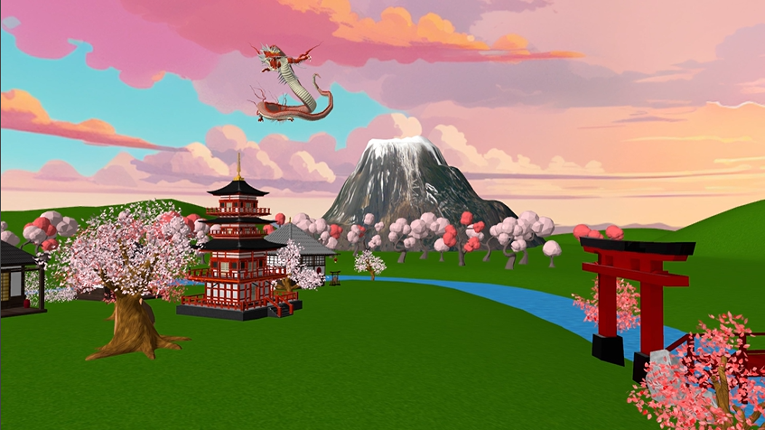
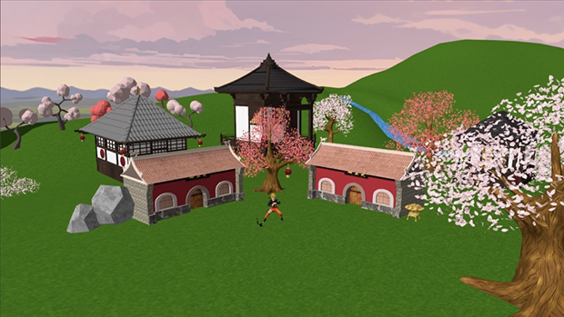
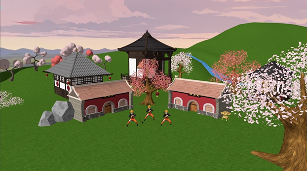

# 🌸 Graphic Processing Project

A graphical simulation created using modern **OpenGL** techniques, featuring dynamic animations, real-time interactions, and a visually rich scene. 🌞

---

## 🏯 Project Overview
The project involves designing and implementing a **3D simulation** of a Japanese village near Mount Fuji. Key elements include a protective dragon, cherry blossom trees, a flowing river, and a Japanese-style bridge, all enhanced with dynamic lighting, fog, and smooth camera animations. 🐉🌸

---

## 🗻 Features
- **🎥 Dynamic Camera**:
  - Smooth transitions, real-time control, and predefined animations.
- **✨ Advanced Lighting**:
  - Directional, point, and spotlight sources for realistic illumination.
- **☁️ Atmospheric Effects**:
  - Fog and shadow mapping for enhanced scene depth.
- **🖱️ Interaction**:
  - Keyboard and mouse controls for real-time adjustments.
- **🎮 Visual Modes**:
  - Toggle between solid, wireframe, polygonal, and smooth rendering.

---

## 🌟 Scene Highlights
The scene includes:
- A **Japanese village** surrounded by cherry blossom trees.
- A **dragon** encircling the village protectively.
- Flowing rivers, bridges, and lanterns casting warm glows.
- Smooth animations for objects and a dynamic environment.

---

##  🍜Implementation Details
### 🚀 Graphics Pipeline
- **Shaders**:
  - Vertex and fragment shaders for rendering.
- **Shadow Mapping**:
  - Framebuffers for realistic shadows.
- **Projections**:
  - Perspective and orthogonal for scene visualization.

### 🧩 Class Structure
- **Camera**:
  - Handles movement, rotation, and view matrices.
- **Model3D**:
  - Manages loading and rendering of 3D models.
- **Shader**:
  - Compiles and links shader programs.
- **Window**:
  - Controls OpenGL context and windowing operations.

---

## 🎮 Controls
- **Camera Movement**:
  - `WASD`: Move the camera.
  - **Mouse**: Rotate the camera.
  - `P`: Start predefined camera animation.
- **Lighting**:
  - `J`, `L`: Rotate the light source.
- **Animations**:
  - `Z`: Toggle Naruto animation (appear).
  - `X`: Toggle Naruto animation (disappear).
- **Rendering Modes**:
  - `1`: Solid Mode.
  - `2`: Wireframe Mode.
  - `3`: Polygonal Mode.
  - `4`: Smooth Mode.

---

## 🪭 Results
- **Successes**:
  - Real-time camera control and animations.
  - Seamless integration of lighting, fog, and shadows.
- **Future Improvements**:
  - Add post-processing effects for realism.
  - Introduce more interactive elements like user-driven animations.

---

## 📷 Screenshots
### Scene

### Animation

---

⭐ **If you enjoyed this project, please give it a star!** 🌟
